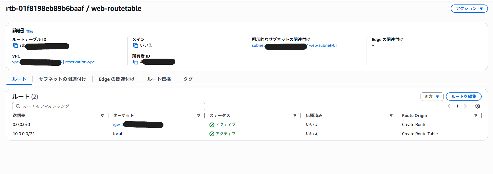

# CloudTech Sprint1 - Reservation System on AWS

*(日本語版は下に続きます / English version first)*

---

## Project Overview

This project demonstrates the deployment of a simple reservation system on AWS.
It is based on the official **CloudTech Sprint1** hands-on curriculum, with additional improvements such as `systemd` persistence, reverse proxy tuning, database verification, and troubleshooting.

**Architecture highlights:**

* VPC (10.0.0.0/21) with two subnets (web, api)
* Internet Gateway + route tables
* EC2 (web-server: Nginx / api-server: Go + MySQL)
* API server managed via systemd
* Reverse proxy with Nginx to expose API on port 80
* Database integration (MySQL, Reservations table)
* Final state: Browser displays *“API Test Success”* and *“DB Test Success”*

---

## Architecture Diagram


---

## AWS Resource Screenshots

* **VPC**
  

* **Subnets**
  
  
* **Route Tables**
  
  

* **Internet Gateway**
  

* **Security Groups**
  
  
* **EC2 Instances**
  
  
---

## Tech Stack

* **AWS**: VPC, EC2, Security Groups, Route Tables, IGW
* **Backend**: Go (API), MySQL (DB)
* **Frontend**: Nginx (static + reverse proxy)
* **OS/Tools**: Amazon Linux 2023, systemd, PowerShell

---

## Setup (Simplified Steps)

1. Create VPC `reservation-vpc (10.0.0.0/21)` and subnets (`web-subnet-01`, `api-subnet-01`).
2. Attach Internet Gateway `reservation-ig` and configure route tables.
3. Launch EC2 instances:

   * `web-server-01` (Amazon Linux 2023, t2.micro)
   * `api-server-01` (Amazon Linux 2023, t2.micro)
4. Install dependencies:

   ```bash
   sudo yum update -y
   sudo yum install -y git golang mysql
   ```
5. Clone repositories:

   ```bash
   git clone https://github.com/CloudTechOrg/cloudtech-reservation-api.git
   git clone https://github.com/CloudTechOrg/cloudtech-reservation-web.git
   ```
6. Configure `goserver.service` with systemd for API auto-start.
7. Configure Nginx reverse proxy (`/api` → localhost:8080).
8. Setup MySQL and create Reservations table:

   ```sql
   CREATE TABLE Reservations (
     id INT AUTO_INCREMENT PRIMARY KEY,
     name VARCHAR(255) NOT NULL,
     created_at TIMESTAMP DEFAULT CURRENT_TIMESTAMP
   );
   ```
9. Test API locally:

   ```bash
   curl http://127.0.0.1:8080/test
   ```
10. Verify via browser at `http://<web-server-ip>`.


Referenced CloudTech learning docs:

* [Sprint1\_APIサーバの構築.md](https://github.com/CloudTechOrg/cloudtech-reservation-api/blob/main/documents/Sprint1_APIサーバの構築.md)
* [Sprint1\_Webサーバの構築.md](https://github.com/CloudTechOrg/cloudtech-reservation-web/blob/main/documents/Sprint1_Webサーバの構築.md)

---

## Verification Screenshots

* **API Test Success**
  

* **DB Test Success**
  

---

## Before / After

| Issue            | Cause                               | Solution                                   | Result            |
| ---------------- | ----------------------------------- | ------------------------------------------ | ----------------- |
| CORS error       | Frontend JS directly called API IP  | Configured Nginx `/api` proxy & updated JS | CORS resolved     |
| DB access denied | .env not loaded / variable mismatch | Added multiple env var aliases             | API connected     |
| Table not found  | `Reservations` table missing        | Created schema manually                    | DB test succeeded |

---

## Learnings & Improvements

* Solved **CORS** with Nginx reverse proxy + JS rewrite.
* Used **systemd** for API persistence across reboots.
* Investigated `.env` issue and fixed by adding multiple env variable names.
* Created **Reservations table** and verified DB connectivity.
* Practiced **step-by-step troubleshooting** (network → service → DB).

---

## Future Enhancements

* Add **IaC (Terraform/CloudFormation)** for reproducibility.
* Introduce **migration tools** (e.g., `golang-migrate`) instead of manual SQL.
* Strengthen **security**: TLS, strict SG rules, DB permissions.
* Add **CI/CD pipeline** with GitHub Actions.

---

# クラウドテック Sprint1 - AWS予約システム (日本語版)

---

## プロジェクト概要

このプロジェクトは、AWS上にシンプルな予約システムを構築したものです。
**CloudTech Sprint1** のハンズオン課題をベースに、`systemd`による永続化・リバースプロキシによるCORS解消・DB接続確認 など独自の改善を加えました。

**構成ポイント:**

* VPC (10.0.0.0/21) と2つのサブネット (web, api)
* インターネットゲートウェイ + ルートテーブル
* EC2 (web-server: Nginx / api-server: Go + MySQL)
* APIサーバーを systemd で常駐化
* Nginxリバースプロキシで80番ポート公開
* MySQL Reservations テーブル作成
* ブラウザで「API接続テスト成功」「DB接続テスト成功」を確認

---

## システム構成図


---

## AWSリソーススクリーンショット

* **VPC**
  

* **サブネット**
  
  

* **ルートテーブル**
  
  

* **インターネットゲートウェイ**
  

* **セキュリティグループ**
  
  

* **EC2インスタンス**
  
  
---

---

## 使用技術

* **AWS**: VPC, EC2, セキュリティグループ, ルートテーブル, IGW
* **バックエンド**: Go (API), MySQL (DB)
* **フロントエンド**: Nginx (静的 + リバースプロキシ)
* **OS/ツール**: Amazon Linux 2023, systemd, PowerShell

---

## セットアップ手順（簡略版）

1. VPC/サブネット/IGW/ルートテーブルを作成。
2. EC2インスタンスを作成:

   * web-server-01
   * api-server-01
3. 依存パッケージをインストール。
4. API/Webリポジトリを clone。
5. systemdサービス (`goserver.service`) を設定。
6. Nginxリバースプロキシを設定。
7. MySQLに Reservations テーブルを作成。
8. curlでAPIを確認。
9. ブラウザでアクセスし、動作確認。

CloudTech提供の学習ドキュメントを参考:

* [Sprint1\_APIサーバの構築.md](https://github.com/CloudTechOrg/cloudtech-reservation-api/blob/main/documents/Sprint1_APIサーバの構築.md)
* [Sprint1\_Webサーバの構築.md](https://github.com/CloudTechOrg/cloudtech-reservation-web/blob/main/documents/Sprint1_Webサーバの構築.md)

---

## 動作確認スクリーンショット

* **API接続テスト成功**
  

* **DB接続テスト成功**
  

---

## Before / After

| 課題      | 原因                  | 解決策                    | 結果      |
| ------- | ------------------- | ---------------------- | ------- |
| CORSエラー | フロントJSが直接APIを参照     | Nginx /api プロキシ + JS修正 | CORS解消  |
| DB認証エラー | .env未読込/変数名不一致      | 環境変数を整理・複数追加           | DB接続成功  |
| テーブル不存在 | Reservationsテーブル未作成 | SQLでテーブル作成             | DBテスト成功 |

---

## 学びと工夫

* **CORS問題** を Nginx＋JS修正で解決できた。
* **systemd** により API を再起動後も自動起動するように設定できた。
* `.env` の読み込み不具合を調査し、複数の変数名で吸収する工夫をした。
* **Reservationsテーブル** を作成して DB接続まで検証できた。
* **段階的トラブルシューティング**（ネットワーク → サービス → DB）で問題を切り分けられた。

---

## 今後の改善点

* **IaC化**（Terraform/CloudFormation）で再現性を高める。
* **マイグレーションツール**（go-migrateなど）を導入する。
* **セキュリティ強化**（TLS、細かい権限制御）。
* **CI/CD導入**（GitHub Actionsなど）。

